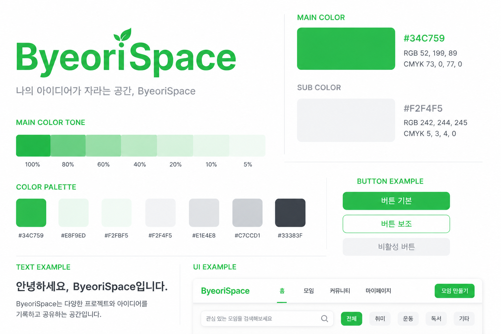

# HobbyMate 서비스기획서


## 브랜드 컬러




---

# 1. 프로젝트 개요

## 1.1 프로젝트명

**HobbyMate**

## 1.2 프로젝트 소개

HobbyMate는 공통의 취미를 가진 사람들이 쉽고 안전하게 모임을 만들고, 온·오프라인 활동을 함께할 수 있도록 지원하는 취미 기반 커뮤니티 플랫폼이다.

단순한 게시판이나 오픈채팅 기반의 모임이 아닌,

- 안전한 본인인증
- 체계적인 모임 관리
- 다양한 게시판
- 정기 만남
- 관리자 기능

등을 제공하여 신뢰성 있는 취미 커뮤니티를 만드는 것을 목표로 한다.

---

# 2. 서비스 목표

HobbyMate는 다음과 같은 문제를 해결하는 것을 목표로 한다.

- 신뢰할 수 없는 익명 모임 문제
- 성별 및 연령 제한이 어려운 기존 커뮤니티
- 게시판과 모임 기능이 분리되어 있는 서비스
- 정모 관리 기능 부족
- 모임 운영자의 관리 기능 부족

이를 해결하기 위해

- 본인인증 기반 회원관리
- 모임 중심 커뮤니티
- 게시판과 만남 기능 통합
- 관리자 중심 신고 처리

기능을 제공한다.

---

# 3. 주요 기능

HobbyMate는 다음 기능으로 구성된다.

- 회원가입
- 로그인
- 본인인증
- 모임 생성
- 모임 가입
- 모임 관리
- 만남 생성
- 게시판
- 댓글
- 이미지 업로드
- 신고
- 건의
- 관리자 페이지

---

# 4. 회원

## 4.1 회원가입

회원가입은 일반 회원가입을 기본으로 제공한다.

향후 카카오 로그인을 추가할 수 있도록 구조를 설계한다.

회원가입 시 반드시 휴대폰 본인인증을 완료해야 한다.

본인인증을 완료하지 않은 사용자는 회원가입을 진행할 수 없다.

---

## 4.2 회원가입 절차

```text
회원가입

↓

아이디 입력

↓

닉네임 입력

↓

비밀번호 입력

↓

휴대폰 본인인증

↓

회원가입 완료
```

---

## 4.3 회원가입 정보

회원가입 시 저장되는 정보

- 로그인 아이디
- 비밀번호(BCrypt 암호화)
- 이름
- 닉네임
- 이메일
- 휴대폰 번호
- 생년월일
- 성별
- 본인인증 CI Hash

---

## 4.4 본인인증

휴대폰 본인인증을 통해 다음 정보를 획득한다.

- 이름
- 생년월일
- 성별
- 휴대폰번호
- 본인 식별 CI

획득한 CI는 SHA-256 등 단방향 해시 후 저장한다.

원본 CI는 저장하지 않는다.

---

## 4.5 로그인

초기 버전은 아이디와 비밀번호를 이용한 일반 로그인을 제공한다.

인증은 Spring Security 기반의 세션 방식으로 처리하며, 비밀번호는 회원가입 시 저장한 BCrypt 해시로 검증한다.

`ACTIVE` 상태 회원만 로그인할 수 있다. 탈퇴 또는 이용 정지 회원, 존재하지 않는 아이디, 잘못된 비밀번호는 모두 다음 통합 메시지로 안내한다.

```text
아이디 또는 비밀번호가 올바르지 않습니다.
```

인증이 필요한 페이지에서 로그인 화면으로 이동한 경우 Saved Request에 저장된 원래 페이지로 복귀하고, 원래 요청이 없으면 메인 페이지 `/`로 이동한다.

아이디 저장 기능은 `hobbymate_saved_id` 쿠키에 아이디만 30일 동안 보관한다. 비밀번호, 인증 정보, 권한, 세션 ID 또는 인증 토큰은 저장하지 않는다. 쿠키 경로는 현재 Context Path를 기준으로 설정하며 서버에서 읽어 화면에 전달한다.

로그인 상태 유지(Remember-me)는 지원하지 않으며 세션 만료 시간은 60분이다.

로그아웃은 CSRF 토큰이 포함된 `POST /auth/logout` 요청으로만 처리한다. 인증 정보를 제거하고 세션을 무효화하되 아이디 저장 쿠키는 유지한다.

---

## 4.6 카카오 로그인

초기 버전에서는 구현하지 않는다.

향후 기능 추가 시

- 카카오 로그인
- 카카오 회원가입

을 지원한다.

카카오 로그인 사용자의 경우에도 휴대폰 본인인증을 수행하여 동일한 회원 정책을 적용한다.

---

## 4.7 회원 권한

회원 권한은 다음과 같다.

| 권한  | 설명      |
| ----- | --------- |
| USER  | 일반 회원 |
| ADMIN | 관리자    |

일반 회원에게는 `ROLE_USER`를 부여한다. 관리자는 일반 회원 기능도 이용할 수 있도록 `ROLE_USER`와 `ROLE_ADMIN`을 함께 부여한다.

---

## 4.8 회원 상태

회원 상태는 다음과 같다.

| 상태      | 설명             |
| --------- | ---------------- |
| ACTIVE    | 정상 이용        |
| SUSPENDED | 관리자 이용 정지 |
| WITHDRAWN | 회원 탈퇴        |

---

## 4.9 회원 탈퇴 정책

회원 탈퇴 시 회원 데이터를 물리 삭제하지 않는다.

탈퇴 회원의 데이터는 관리자 감사 및 운영 기록을 위해 보관한다.

회원 탈퇴 시 다음과 같이 처리한다.

| 항목          | 처리 방법                                  |
| ------------- | ------------------------------------------ |
| LOGIN_ID      | 유지                                       |
| PASSWORD      | 유지                                       |
| NAME          | 유지                                       |
| PHONE         | 유지                                       |
| BIRTH_DATE    | 유지                                       |
| GENDER        | 유지                                       |
| CI_HASH       | NULL 처리                                  |
| NICKNAME      | 탈퇴회원{회원번호}로 변경                  |
| EMAIL         | deleted_{회원번호}@hobbymate.local 로 변경 |
| MEMBER_STATUS | WITHDRAWN 변경                             |
| WITHDRAWN_AT  | 탈퇴 시각 저장                             |

---

## 4.10 재가입 정책

회원 탈퇴 후 즉시 재가입할 수 있다.

재가입 시에는 기존 회원 정보를 복구하지 않고 새로운 회원으로 가입한다.

따라서

- 새로운 MEMBER_ID가 생성된다.
- 기존 아이디는 사용할 수 없다.
- 기존 닉네임은 사용할 수 있다.
- 기존 이메일은 사용할 수 있다.

관리자에 의해 이용 정지된 회원은 서비스 정책에 따라 재가입이 제한될 수 있다.

---

## 4.11 중복가입 정책

회원가입 시 인인증을 통해 획득한 CI Hash를 이용하여 동일인 여부를 확인한다.

동일한 CI Hash를 가진 ACTIVE 회원이 존재할 경우 회원가입을 제한한다.

WITHDRAWN 회원은 CI Hash를 NULL 처리하므로 새로운 회원으로 가입할 수 있다.

---

## 4.12 개인정보 보호

회원 개인정보는 최소한으로 저장한다.

비밀번호는 BCrypt로 암호화하여 저장한다.

CI는 해시값만 저장한다.

휴대폰 번호는 회원 탈퇴 후에도 보관한다.

이메일과 닉네임은 탈퇴 시 변경하여 재사용이 가능하도록 한다.

관리자는 개인정보를 최소한으로 조회할 수 있도록 한다.

---

## 4.13 마이페이지

마이페이지는 로그인한 `ACTIVE` 회원과 관리자만 접근할 수 있으며, 내부 URL은 `GET /member/mypage`를 사용한다. 비로그인 사용자는 Spring Security 로그인 화면으로 이동하고 로그인 성공 후 Saved Request에 따라 마이페이지로 복귀한다.

조회 대상은 URL 파라미터나 hidden input으로 지정하지 않고 Spring Security 인증 객체의 회원 번호로 식별한다. 회원은 현재 로그인한 자신의 정보만 조회할 수 있다.

마이페이지에는 다음 기본정보만 표시한다.

- 프로필 이미지
- 닉네임
- 로그인 아이디
- 이름
- 이메일
- 휴대폰 번호
- 성별
- 생년월일
- 가입일

휴대폰 번호는 가운데 번호를 마스킹하여 표시하고, 생년월일과 가입일은 `yyyy.MM.dd` 형식으로 표시한다. 비밀번호, CI, 탈퇴 여부, 관리자 여부 등의 민감정보와 내부 운영정보는 조회 결과 및 화면에 포함하지 않는다.

프로필 이미지가 등록되지 않은 경우 기본 프로필 이미지를 사용한다. 로그인 아이디는 본인 마이페이지에서만 기본정보로 표시하며, 헤더·게시글 작성자·댓글 작성자·모임 회원명처럼 다른 회원에게 노출되는 영역에서는 닉네임을 사용한다.

프로필 이미지 등록·변경·삭제 및 활동 내역은 후속 개발 범위로 둔다.

운영 환경의 `/hobbymate`는 Context Path로 적용하며 컨트롤러, Spring Security, 템플릿 및 정적 리소스 내부 URL에 직접 하드코딩하지 않는다.

---

## 4.14 회원정보 수정

회원정보 수정은 로그인한 `ACTIVE` 회원과 관리자만 이용할 수 있으며, 내부 URL은 `GET /member/mypage/edit`과 `POST /member/mypage/edit`을 사용한다. 수정 대상은 URL 파라미터나 hidden input으로 지정하지 않고 Spring Security 인증 객체의 회원 번호로 식별하므로 현재 로그인한 본인의 정보만 수정할 수 있다.

회원이 직접 수정할 수 있는 항목은 닉네임과 이메일로 제한한다. 로그인 아이디, 이름, 휴대폰 번호, 성별, 생년월일은 변경할 수 없으며 수정 화면에서는 조회 정보로만 표시한다. 휴대폰 번호는 가운데 번호를 마스킹하고, 휴대폰 번호 변경은 추후 본인인증을 다시 수행하는 별도 기능으로 제공한다. 비밀번호와 CI는 수정 화면 및 요청 객체에 포함하지 않는다.

닉네임은 회원가입과 동일하게 앞뒤 공백을 제거한 필수값으로 최대 50자까지 허용한다. 다른 닉네임으로 변경하는 경우 중복확인을 진행하고, 저장 시 서버가 현재 회원 자신을 제외하여 다시 중복 여부를 검사한다. 현재 닉네임을 유지하는 경우에는 중복확인을 요구하지 않는다. 탈퇴 회원은 탈퇴 처리 시 닉네임이 대체되므로 기존 닉네임을 재사용할 수 있다.

이메일은 앞뒤 공백을 제거하고 소문자로 정규화하며 필수값·형식·최대 255자를 서버에서 검증한다. 이메일 중복확인 UI와 API는 제공하지 않는다.

수정 SQL은 `NICKNAME`, `EMAIL`만 변경하고 `MEMBER_ID` 및 `MEMBER_STATUS = 'ACTIVE'` 조건을 적용한다. 수정일시는 `UPDATED_AT`의 기존 자동 갱신 정책을 따른다. 수정 성공 후 현재 Spring Security 인증 객체의 닉네임을 즉시 갱신하여 재로그인 없이 공통 헤더에 반영하고, Flash Attribute로 성공 메시지를 한 번 표시한다.

운영 환경의 `/hobbymate`는 Context Path로 적용하며 내부 URL에 직접 하드코딩하지 않는다.

---

## 4.15 비밀번호 변경

비밀번호 변경은 로그인한 `ACTIVE` 회원과 관리자만 이용할 수 있으며, 내부 URL은 `GET /member/mypage/password`와 `POST /member/mypage/password`를 사용한다. 변경 대상은 URL 파라미터나 hidden input으로 지정하지 않고 Spring Security 인증 객체의 회원 번호로 식별하므로 현재 로그인한 본인의 비밀번호만 변경할 수 있다.

현재 비밀번호, 새 비밀번호, 새 비밀번호 확인은 모두 필수다. 현재 비밀번호는 DB의 최신 BCrypt 해시와 `PasswordEncoder.matches()`로 비교하고, 새 비밀번호와 확인값의 일치 여부를 서버에서 다시 검증한다. 새 비밀번호는 회원가입과 동일하게 8~255자, 공백 없이 영문·숫자·특수문자 중 2종 이상을 사용해야 하며 서버가 값을 임의로 trim하지 않는다.

새 비밀번호는 DB의 기존 해시와 `PasswordEncoder.matches()`로 비교하여 현재 비밀번호와 같은 값의 재사용을 차단한다. 모든 검증을 통과한 경우에만 `PasswordEncoder.encode()`로 한 번 암호화하여 `PASSWORD` 컬럼만 수정한다. `UPDATED_AT`은 DB의 기존 자동 갱신 정책을 따르며 로그인 아이디, 닉네임, 이메일, 권한 및 다른 회원정보는 변경하지 않는다.

변경 성공 후 마이페이지로 이동하여 Flash Attribute 성공 메시지를 한 번 표시하고, 현재 세션과 `ROLE_USER`·`ROLE_ADMIN` 권한은 유지한다. 다른 기기 세션 종료와 전체 기기 로그아웃, 비밀번호 찾기 및 재설정은 후속 개발 범위로 둔다.

비밀번호 평문과 해시는 로그, Model, Flash Attribute, URL 및 브라우저 저장소에 노출하지 않는다. POST 요청의 CSRF 보호를 유지하고 운영 환경의 `/hobbymate`는 Context Path로 적용하여 내부 URL에 직접 하드코딩하지 않는다.

---

## 4.16 회원 탈퇴 기능

회원 탈퇴는 로그인한 `ACTIVE` 회원과 관리자만 이용할 수 있으며, 내부 URL은 `GET /member/mypage/withdraw`와 `POST /member/mypage/withdraw`를 사용한다. 탈퇴 대상은 URL 파라미터나 hidden input으로 지정하지 않고 Spring Security 인증 객체의 회원 번호로 식별하므로 현재 로그인한 본인의 계정만 탈퇴할 수 있다.

현재 비밀번호와 탈퇴 동의는 필수다. 서버는 DB의 최신 BCrypt 해시와 `PasswordEncoder.matches()`로 현재 비밀번호를 검증하고, 동의값이 `true`인지 다시 확인한다. POST 요청에는 CSRF 보호를 유지하며 비밀번호는 trim하거나 로그, Model, Flash Attribute, URL 및 브라우저 저장소에 노출하지 않는다.

탈퇴는 회원 행을 삭제하지 않는 Soft Delete 방식으로 하나의 트랜잭션에서 처리한다. `MEMBER_STATUS`를 `WITHDRAWN`으로 변경하고 `WITHDRAWN_AT`에 탈퇴 시각을 저장하며 `CI_HASH`는 NULL 처리한다. 닉네임은 `탈퇴회원{MEMBER_ID}`, 이메일은 `deleted_{MEMBER_ID}@hobbymate.local`로 변경하여 기존 닉네임과 이메일을 재사용할 수 있게 한다. 로그인 아이디와 비밀번호, 이름, 휴대폰 번호, 생년월일, 성별 및 프로필 이미지 경로는 유지한다.

회원 탈퇴 시 게시글과 댓글, 프로필 이미지 파일은 삭제하거나 수정하지 않는다. 현재 스키마에는 본인 탈퇴용 회원 이력 테이블이 없고 `HM_ADMIN_ACTION_HISTORY`는 관리자 처리 전용이므로 별도 탈퇴 이력을 저장하지 않는다.

DB UPDATE가 정확히 1건 완료된 뒤에만 Spring Security 인증 정보를 제거하고 기존 HTTP Session을 무효화한다. 이후 비로그인 메인 화면 `/`로 이동하며 새 익명 세션의 Flash Attribute로 `회원 탈퇴가 완료되었습니다.` 메시지를 한 번 표시한다. 운영 환경의 `/hobbymate`는 Context Path로 적용하고 내부 URL에 직접 하드코딩하지 않는다.

---

# 5. 모임

## 5.1 모임

HobbyMate의 핵심 기능이다.

회원은 원하는 취미의 모임을 직접 생성하거나 기존 모임에 가입하여 활동할 수 있다.

모임은 하나의 독립된 커뮤니티이며

- 가입회원
- 게시판
- 만남
- 운영진

을 가진다.

---

## 5.2 모임 생성

회원은 모임을 생성할 수 있다.

모임 생성 시 다음 정보를 입력한다.

- 모임명
- 카테고리
- 대표 이미지
- 한줄 소개
- 상세 소개
- 모집 인원
- 모집 여부
- 가입 방식
- 성별 제한
- 연령 제한

---

## 5.3 카테고리

모든 모임은 하나의 카테고리를 가진다.

예시

- 운동
- 독서
- 게임
- 여행
- 음악
- 사진
- 요리
- 뜨개질
- 캠핑

카테고리는 관리자가 관리한다.

---

## 5.4 가입 방식

모임은 다음 두 가지 가입 방식을 제공한다.

| 방식      | 설명                        |
| --------- | --------------------------- |
| 즉시 가입 | 가입 즉시 모임 활동 가능    |
| 가입 승인 | 운영자가 승인해야 가입 가능 |

---

## 5.5 성별 제한

모임 생성 시 운영자는 모집 성별을 선택할 수 있다.

| 값     | 설명   |
| ------ | ------ |
| FEMALE | 여성만 |
| MALE   | 남성만 |
| ALL    | 혼성   |

회원가입 시 저장된 성별을 이용하여 가입 가능 여부를 판단한다.

---

## 5.6 연령 제한

운영자는 가입 가능한 최소 연령과 최대 연령을 설정할 수 있다.

회원가입 시 저장된 생년월일을 기준으로 자동으로 가입 가능 여부를 확인한다.

---

## 5.7 모집 인원

모집 인원을 설정할 수 있다.

예시

- 최대 10명
- 최대 30명
- 최대 100명

모집 인원 초과 시
가입을 제한한다.

---

## 5.8 모임 소개

모임 메인 화면에서는 다음 정보를 제공한다.

- 대표 이미지
- 모임 이름
- 카테고리
- 모임 소개
- 운영자
- 회원 수
- 가입 버튼

---

## 5.9 모임 운영자

모임 생성자는 자동으로 운영자가 된다.

운영자는

- 가입 승인
- 회원 강퇴
- 게시글 관리
- 만남 생성

권한을 가진다.

---

# 6. 만남

## 6.1 만남

모임은 정기모임 또는 번개모임을 생성할 수 있다.

만남은

- 대면
- 비대면

두 가지 유형을 지원한다.

---

## 6.2 만남 유형

| 유형    | 설명   |
| ------- | ------ |
| OFFLINE | 대면   |
| ONLINE  | 비대면 |

---

## 6.3 대면 만남

대면 만남은

다음 정보를 입력한다.

- 제목
- 날짜
- 시간
- 장소
- 모집 인원
- 참가비
- 내용

장소 입력 시 카카오 지도 또는 네이버 지도 API를 이용하여 장소를 검색한다.

선택한 장소는

- 주소
- 위도
- 경도

를 저장한다.

---

## 6.4 비대면 만남

비대면 만남은 다음 정보를 입력한다.

- 제목
- 날짜
- 시간
- 접속 링크
- 모집 인원
- 내용

Zoom / Google Meet / Discord 등의 링크를 등록할 수 있다.

---

## 6.5 참가 신청

회원은 만남 참가 신청을 할 수 있다.

참가 인원이 모집 인원을 초과하면

신청을 제한한다.

---

## 6.6 참가 취소

참가자는 만남 시작 전까지 참가를 취소할 수 있다.

---

# 7. 게시판

모임 내부에는 세 개의 게시판을 제공한다.

- 자유게시판
- 만남 모집 게시판
- 만남 후기 게시판

---

## 7.1 자유게시판

모임 회원만 이용 가능하다.

자유로운 글을 작성한다.

---

## 7.2 만남 모집 게시판

운영자 또는 권한이 있는 회원이 만남을 모집하는 게시판이다.

---

## 7.3 만남 후기 게시판

만남 종료 후 후기를 작성하는 게시판이다.

사진 업로드가 가능하다.

---

## 7.4 전체 게시판

모임과 별도로 서비스 전체 게시판을 제공한다.

- 공지사항
- 자유게시판
- 건의
- 신고

---

## 7.5 공지사항

관리자만 작성할 수 있다.

모든 회원이 조회할 수 있다.

---

## 7.6 전체 자유게시판

전체 회원이 자유롭게 이용하는 게시판이다.

---

## 7.7 건의 게시판

회원은 서비스 개선사항을 건의할 수 있다.

작성자와 관리자만 조회 가능하다.

---

## 7.8 신고 게시판

회원은 게시글, 댓글, 회원, 모임 등을 신고할 수 있다.

작성자와 관리자만 조회 가능하다.

---

## 7.9 댓글

모든 게시판은 댓글 기능을 제공한다.

대댓글은 추후 기능으로 추가할 예정이다.

---

## 7.10 이미지 업로드

게시글 작성 시 최대 25장의 이미지를 업로드할 수 있다.

---

## 7.11 블로그형 에디터

게시글은 단순 textarea가 아닌 블로그형 에디터를 제공한다.

이미지는 본문 중간에 자유롭게 삽입할 수 있다.

또한

- 왼쪽 정렬
- 가운데 정렬
- 오른쪽 정렬

을 지원한다.

---

# 8. 관리자

## 8.1 관리자 페이지

관리자는 관리자 페이지를 통해 서비스 전체를 관리할 수 있다.

관리자는 일반 회원과 구분되는 ADMIN 권한을 가진다.

---

## 8.2 회원 관리

관리자는 다음 기능을 수행할 수 있다.

- 회원 조회
- 회원 검색
- 회원 상세 조회
- 회원 상태 변경
- 회원 이용 정지
- 회원 이용 정지 해제

회원 탈퇴 여부도 확인할 수 있다.

---

## 8.3 모임 관리

관리자는 서비스에 등록된 모든 모임을 조회할 수 있다.

필요한 경우

- 모임 수정
- 모임 삭제
- 모집 중지

등을 수행할 수 있다.

---

## 8.4 게시글 관리

관리자는 전체 게시글을 조회할 수 있다.

필요한 경우

- 게시글 삭제
- 게시글 복원
- 댓글 삭제

등을 수행할 수 있다.

---

## 8.5 신고 관리

회원이 신고한 내역을 조회한다.

신고 처리 상태를 변경할 수 있다.

예시

- 접수
- 처리중
- 처리완료
- 반려

---

## 8.6 건의 관리

회원이 등록한 건의를 조회한다.

관리자는 건의에 답변을 등록할 수 있다.

건의 내용은 작성자와 관리자만 조회할 수 있다.

---

## 8.7 카테고리 관리

관리자는 취미 카테고리를 관리한다.

가능한 기능

- 카테고리 등록
- 카테고리 수정
- 카테고리 삭제
- 사용 여부 변경
- 정렬 순서 변경

---

## 8.8 관리자 작업 이력

관리자가 수행한 모든 주요 작업은 관리자 작업 이력에 저장한다.

기록 대상 예시

- 회원 정지
- 회원 정지 해제
- 게시글 삭제
- 게시글 복원
- 신고 처리
- 건의 답변
- 카테고리 수정
- 모임 삭제

기록 정보

- 작업 관리자
- 작업 유형
- 대상 데이터
- 작업 일시
- 작업 내용

---

# 9. 파일 업로드

## 9.1 업로드 대상

이미지 업로드를 지원한다.

업로드 대상

- 게시글 이미지
- 후기 이미지
- 모임 대표 이미지
- 프로필 이미지(추후)

---

## 9.2 이미지 정책

지원 확장자

- jpg
- jpeg
- png
- gif
- webp

이미지 개수 : 최대 25장

---

## 9.3 이미지 저장

이미지는

파일 시스템에 저장하고

DB에는

- 저장 경로
- 원본 파일명
- 저장 파일명

등을 저장한다.

향후 AWS S3로 변경 가능하도록 구조를 설계한다.

---

# 10. 권한 정책

| 기능             | 비회원 | 회원 | 모임회원 | 운영자 | 관리자 |
| ---------------- | ------ | ---- | -------- | ------ | ------ |
| 회원가입         | O      | -    | -        | -      | -      |
| 로그인           | O      | -    | -        | -      | -      |
| 마이페이지 조회  | -      | O    | O        | O      | O      |
| 회원정보 수정    | -      | O    | O        | O      | O      |
| 비밀번호 변경    | -      | O    | O        | O      | O      |
| 회원 탈퇴        | -      | O    | O        | O      | O      |
| 모임 조회        | O      | O    | O        | O      | O      |
| 모임 생성        | -      | O    | O        | O      | O      |
| 모임 가입        | -      | O    | O        | O      | O      |
| 모임 게시판 조회 | -      | -    | O        | O      | O      |
| 모임 게시글 작성 | -      | -    | O        | O      | O      |
| 만남 생성        | -      | -    | -        | O      | O      |
| 공지 작성        | -      | -    | -        | -      | O      |
| 회원 관리        | -      | -    | -        | -      | O      |

---

# 11. 보안 정책

서비스는 안전한 회원 관리를 위해 다음 정책을 적용한다.

## 비밀번호

비밀번호는 BCrypt를 이용하여 암호화 후 저장한다.

원문은 저장하지 않는다.

회원가입과 변경에는 8~255자, 공백 없이 영문·숫자·특수문자 중 2종 이상을 사용하는 동일한 정책을 적용한다. 비밀번호 변경 시 현재 비밀번호와 기존 비밀번호 재사용 여부는 DB의 최신 해시를 기준으로 `PasswordEncoder.matches()`를 사용해 확인하며, 변경된 비밀번호만 다시 BCrypt로 암호화한다.

---

## 본인인증

휴대폰 본인인증을 이용한다.

획득 정보

- 이름
- 성별
- 생년월일
- 휴대폰번호
- CI

CI는 해시값만 저장한다.

---

## 회원 탈퇴

회원 데이터는 삭제하지 않는다.

현재 로그인한 본인이 현재 비밀번호 확인과 탈퇴 동의를 완료한 경우에만 Soft Delete를 수행한다.

탈퇴 시

- MEMBER_STATUS WITHDRAWN
- WITHDRAWN_AT 저장
- CI_HASH NULL
- 닉네임 변경
- 이메일 변경

처리한다.

휴대폰 번호와 로그인 아이디는 보관하고, DB 처리 완료 후 인증 정보와 기존 세션을 종료한다.

---

## 접근 권한

Spring Security를 이용하여 권한별 접근 제어를 수행한다.

---

# 12. 향후 개발 예정 기능

초기 버전 이후 다음 기능을 순차적으로 추가한다.

## 로그인

- 카카오 로그인
- 네이버 로그인
- Google 로그인

단, 소셜 로그인 사용자도 휴대폰 본인인증을 수행한다.

---

## 알림

- 댓글 알림
- 가입 승인 알림
- 만남 알림

---

## 채팅

모임별 채팅 기능

---

## 즐겨찾기

관심 모임 등록

---

## 프로필

프로필 이미지

자기소개

관심 취미

활동 내역

---

## 검색

통합 검색

- 모임
- 게시글
- 회원

---

## 관리자

통계

대시보드

회원 활동 분석

---

# 13. 기술 스택

Backend

- Java
- Spring Boot
- Spring Security
- MyBatis

Database

- MariaDB

Frontend

- Thymeleaf
- HTML
- CSS
- JavaScript

Build Tool

- Maven

IDE

- STS4

Version Control

- Git
- GitHub

## 13.1 운영 Context Path

운영 배포 경로는 `https://byeorispace.com/hobbymate`이며, 운영 설정에서 `server.servlet.context-path=/hobbymate`를 적용한다.

컨트롤러와 Spring Security의 내부 URL에는 `/hobbymate`를 직접 붙이지 않는다. Thymeleaf URL 표현식과 현재 요청의 Context Path를 사용하여 링크, 폼, 정적 리소스, 리다이렉트 및 쿠키 경로가 개발 환경과 운영 환경에서 동일하게 동작하도록 구성한다.

---

# 14. 프로젝트 목표

HobbyMate는 단순한 취미 게시판이 아닌 신뢰성 있는 취미 기반 커뮤니티 플랫폼을 목표로 한다.

회원 간의 안전한 만남과 건전한 커뮤니티 운영을 위해 본인인증 기반 회원관리,  운영자 중심의 모임 관리, 관리자 중심의 서비스 운영을 제공한다.

또한 향후 소셜 로그인, 실시간 채팅, 알림, 통계 기능 등을 추가하여 완성도 높은 커뮤니티 플랫폼으로 발전시키는 것을 목표로 한다.
