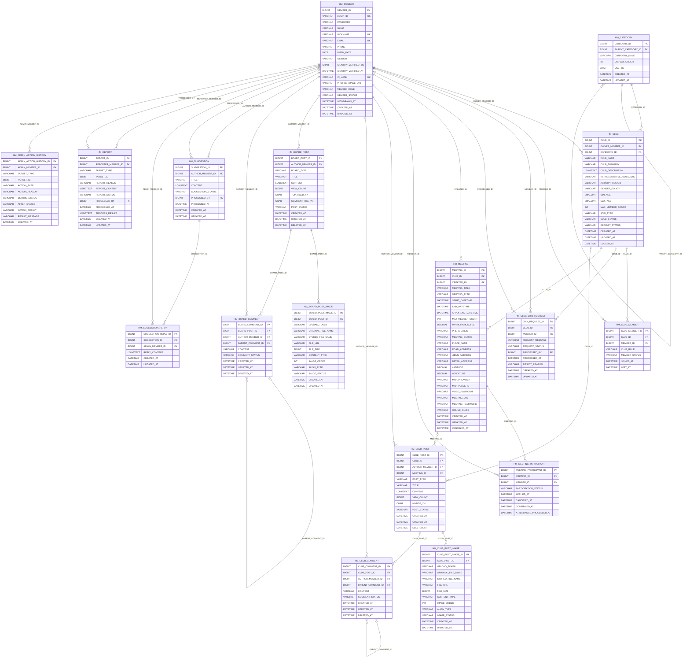

# HobbyMate ERD

## 설계 참고

- `HM_MEMBER.PHONE`은 본인인증 휴대폰 번호이며 `NOT NULL`로 관리하고, 회원 탈퇴 후에도 기존 값을 보관한다.
- `HM_MEMBER.CI_HASH`는 중복가입 확인용 식별값이며 `UNIQUE`로 관리한다.
- 일반 회원 탈퇴 시 `CI_HASH`를 `NULL`로 변경한다. MariaDB의 UNIQUE 인덱스는 여러 개의 `NULL`을 허용하므로 탈퇴 회원이 여러 명이어도 충돌하지 않는다.
- 탈퇴 회원의 `LOGIN_ID`는 유지하여 재사용을 허용하지 않는다.
- 탈퇴 회원의 `NICKNAME`과 `EMAIL`은 탈퇴용 값으로 변경하여 기존 값을 다시 사용할 수 있게 한다.
- `HM_MEMBER.PROFILE_IMAGE_URL`은 기존 컬럼명을 유지하지만 전체 URL이 아닌 UUID 기반 프로필 이미지 저장 파일명만 보관한다. 미등록·삭제 상태는 `NULL`이며 기본 이미지 경로는 저장하지 않는다.
- 프로필 이미지 원본 파일은 외부 파일 시스템에 저장하고 회원 탈퇴 시 컬럼 값과 실제 파일을 유지한다.
- 탈퇴 후 재가입하면 기존 회원을 복구하지 않고 새로운 `MEMBER_ID`를 발급한다.
- `HM_REPORT.TARGET_ID`와 `HM_ADMIN_ACTION_HISTORY.TARGET_ID`는 여러 테이블의 PK를 가리키는 다형 대상이므로 물리 FK를 설정하지 않는다.
- `HM_REPORT.TARGET_TYPE + TARGET_ID`와 `HM_ADMIN_ACTION_HISTORY.TARGET_TYPE + TARGET_ID`의 유효성은 서비스 계층에서 검증한다.
- `HM_CLUB_POST.MEETING_ID`는 만남 모집글·후기글에서 선택적으로 사용하며 자유글에서는 `NULL`이다.
- `HM_CLUB_COMMENT.PARENT_COMMENT_ID`와 `HM_BOARD_COMMENT.PARENT_COMMENT_ID`는 대댓글에서만 사용한다.
- 모임 내부 게시판과 만남 기능의 접근 권한은 `HM_CLUB_MEMBER`를 기준으로 서비스 계층에서 검증한다.
- 관리자 대상 데이터의 상태 변경과 `HM_ADMIN_ACTION_HISTORY` 저장은 하나의 트랜잭션으로 처리한다.
- `HM_ADMIN_ACTION_HISTORY`는 감사 이력이므로 일반 수정·삭제 기능을 제공하지 않는다.

## 회원 탈퇴 처리 기준

| 컬럼 | 탈퇴 처리 |
|---|---|
| `LOGIN_ID` | 기존 값 유지, 재사용 불가 |
| `PHONE` | 기존 값 유지 |
| `CI_HASH` | `NULL` 처리 |
| `NICKNAME` | `탈퇴회원{MEMBER_ID}`로 변경 |
| `EMAIL` | `deleted_{MEMBER_ID}@hobbymate.local`로 변경 |
| `MEMBER_STATUS` | `WITHDRAWN`으로 변경 |
| `WITHDRAWN_AT` | 탈퇴 처리 시각 저장 |

## 관리자 처리 이력 코드

### 대상 유형

| 값 | 설명 |
|---|---|
| `MEMBER` | 회원 |
| `CLUB` | 모임 |
| `MEETING` | 만남 |
| `CLUB_POST` | 모임 내부 게시글 |
| `CLUB_COMMENT` | 모임 내부 댓글 |
| `BOARD_POST` | 서비스 전체 게시글 |
| `BOARD_COMMENT` | 서비스 전체 댓글 |
| `REPORT` | 신고 |
| `SUGGESTION` | 건의 |
| `CATEGORY` | 취미 카테고리 |

### 처리 유형

| 값 | 설명 |
|---|---|
| `SUSPEND` | 회원 이용 정지 |
| `UNSUSPEND` | 회원 이용 정지 해제 |
| `BLOCK` | 모임·만남·게시글·댓글 차단 |
| `UNBLOCK` | 차단 해제 |
| `DELETE` | 관리자 삭제 처리 |
| `RESTORE` | 삭제 또는 차단 데이터 복원 |
| `APPROVE` | 승인 처리 |
| `REJECT` | 거절 또는 반려 |
| `COMPLETE` | 신고·건의 처리 완료 |
| `UPDATE` | 기타 관리자 수정 |

### 처리 결과

| 값 | 설명 |
|---|---|
| `SUCCESS` | 정상 처리 완료 |
| `FAIL` | 처리 실패 |
| `CANCELED` | 처리 취소 |
