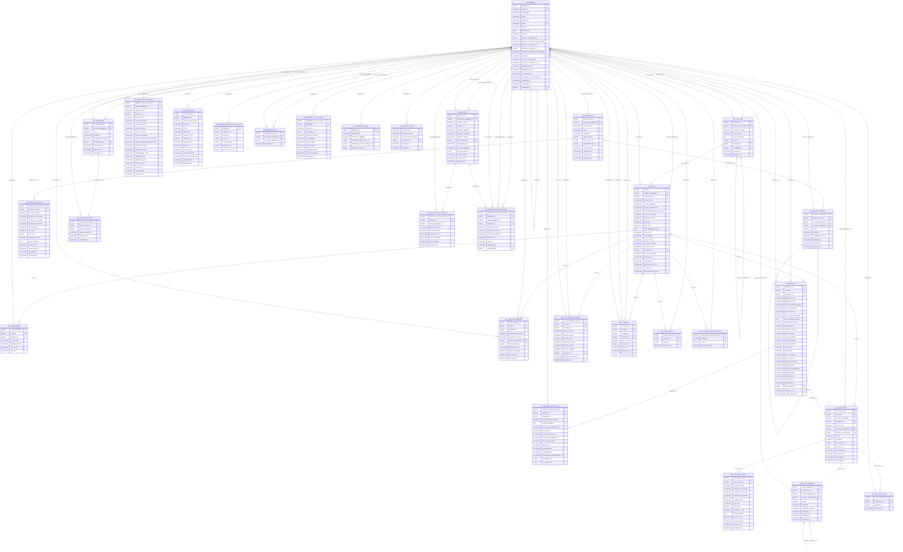

# HobbyMate ERD

```mermaid
erDiagram
    HM_MEMBER ||--o{ HM_CLUB : "OWNER_MEMBER_ID"
    HM_CATEGORY ||--o{ HM_CLUB : "CATEGORY_ID"
    HM_CATEGORY o|--o{ HM_CATEGORY : "PARENT_CATEGORY_ID"
    HM_MEMBER o|--o{ HM_CATEGORY : "CREATED_BY"
    HM_MEMBER o|--o{ HM_CATEGORY : "UPDATED_BY"

    HM_CLUB ||--o{ HM_CLUB_MEMBER : "CLUB_ID"
    HM_MEMBER ||--o{ HM_CLUB_MEMBER : "MEMBER_ID"

    HM_CLUB ||--o{ HM_CLUB_JOIN_REQUEST : "CLUB_ID"
    HM_MEMBER ||--o{ HM_CLUB_JOIN_REQUEST : "MEMBER_ID"
    HM_MEMBER o|--o{ HM_CLUB_JOIN_REQUEST : "PROCESSED_BY"

    HM_CLUB ||--o{ HM_MEETING : "CLUB_ID"
    HM_MEMBER ||--o{ HM_MEETING : "CREATED_BY"

    HM_MEETING ||--o{ HM_MEETING_PARTICIPANT : "MEETING_ID"
    HM_MEMBER ||--o{ HM_MEETING_PARTICIPANT : "MEMBER_ID"

    HM_CLUB ||--o{ HM_CLUB_POST : "CLUB_ID"
    HM_MEMBER ||--o{ HM_CLUB_POST : "AUTHOR_MEMBER_ID"
    HM_MEETING o|--o{ HM_CLUB_POST : "MEETING_ID"

    HM_CLUB_POST ||--o{ HM_CLUB_POST_IMAGE : "CLUB_POST_ID"
    HM_CLUB_POST ||--o{ HM_CLUB_COMMENT : "CLUB_POST_ID"
    HM_MEMBER ||--o{ HM_CLUB_COMMENT : "AUTHOR_MEMBER_ID"
    HM_CLUB_COMMENT o|--o{ HM_CLUB_COMMENT : "PARENT_COMMENT_ID"

    HM_MEMBER ||--o{ HM_BOARD_POST : "AUTHOR_MEMBER_ID"
    HM_BOARD_POST ||--o{ HM_BOARD_POST_IMAGE : "BOARD_POST_ID"
    HM_BOARD_POST ||--o{ HM_BOARD_COMMENT : "BOARD_POST_ID"
    HM_MEMBER ||--o{ HM_BOARD_COMMENT : "AUTHOR_MEMBER_ID"
    HM_BOARD_COMMENT o|--o{ HM_BOARD_COMMENT : "PARENT_COMMENT_ID"

    HM_MEMBER ||--o{ HM_SUGGESTION : "AUTHOR_MEMBER_ID"
    HM_MEMBER o|--o{ HM_SUGGESTION : "PROCESSED_BY"
    HM_SUGGESTION ||--o{ HM_SUGGESTION_REPLY : "SUGGESTION_ID"
    HM_MEMBER ||--o{ HM_SUGGESTION_REPLY : "ADMIN_MEMBER_ID"

    HM_MEMBER ||--o{ HM_REPORT : "REPORTER_MEMBER_ID"
    HM_MEMBER o|--o{ HM_REPORT : "PROCESSED_BY"

    HM_MEMBER ||--o{ HM_ADMIN_ACTION_HISTORY : "ADMIN_MEMBER_ID"
    HM_MEMBER o|--o{ HM_MEMBER : "IDENTITY_VERIFIED_BY"
    HM_MEMBER o|--o{ HM_MEMBER : "UPDATED_BY"
    HM_CLUB ||--o{ HM_CLUB_MEMBER_HISTORY : "CLUB_ID"
    HM_MEMBER ||--o{ HM_CLUB_MEMBER_HISTORY : "MEMBER_ID"
    HM_MEMBER o|--o{ HM_CLUB_MEMBER_HISTORY : "ACTION_BY"
    HM_CLUB ||--o{ HM_CLUB_BAN : "CLUB_ID"
    HM_MEMBER ||--o{ HM_CLUB_BAN : "MEMBER_ID"
    HM_MEMBER ||--o{ HM_CLUB_BAN : "BANNED_BY"
    HM_MEMBER o|--o{ HM_CLUB_BAN : "RELEASED_BY"
    HM_MEMBER o|--o{ HM_CLUB : "CLOSED_BY"
    HM_MEMBER o|--o{ HM_MEETING : "CANCELED_BY"
    HM_MEMBER ||--o{ HM_CLUB_FAVORITE : "MEMBER_ID"
    HM_CLUB ||--o{ HM_CLUB_FAVORITE : "CLUB_ID"
    HM_CLUB_POST ||--o{ HM_CLUB_POST_LIKE : "CLUB_POST_ID"
    HM_MEMBER ||--o{ HM_CLUB_POST_LIKE : "MEMBER_ID"
    HM_MEMBER ||--o{ HM_NOTIFICATION : "MEMBER_ID"
    HM_MEMBER ||--|| HM_MEMBER_NOTIFICATION_SETTING : "MEMBER_ID"
    HM_MEMBER ||--o{ HM_CLUB_NOTIFICATION_SETTING : "MEMBER_ID"
    HM_CLUB ||--o{ HM_CLUB_NOTIFICATION_SETTING : "CLUB_ID"
    HM_REPORT ||--o{ HM_REPORT_ACTION_HISTORY : "REPORT_ID"
    HM_MEMBER ||--o{ HM_REPORT_ACTION_HISTORY : "ADMIN_MEMBER_ID"
    HM_MEMBER ||--o{ HM_MEMBER_SANCTION_HISTORY : "MEMBER_ID"
    HM_MEMBER ||--o{ HM_MEMBER_SANCTION_HISTORY : "ADMIN_MEMBER_ID"
    HM_MEMBER o|--o{ HM_MEMBER_SANCTION_HISTORY : "REVOKED_BY"
    HM_REPORT o|--o{ HM_MEMBER_SANCTION_HISTORY : "REPORT_ID"
    HM_MEMBER ||--o{ HM_MEMBER_BLOCK : "BLOCKER_MEMBER_ID"
    HM_MEMBER ||--o{ HM_MEMBER_BLOCK : "BLOCKED_MEMBER_ID"
    HM_MEMBER o|--o{ HM_MEMBER_LOGIN_HISTORY : "MEMBER_ID"
    HM_MEMBER ||--|| HM_MEMBER_PROFILE : "MEMBER_ID"
    HM_MEMBER ||--o{ HM_SERVICE_SETTING : "UPDATED_BY"

    HM_MEMBER {
        BIGINT MEMBER_ID PK
        VARCHAR LOGIN_ID UK
        VARCHAR PASSWORD
        VARCHAR NAME
        VARCHAR NICKNAME UK
        VARCHAR EMAIL UK
        VARCHAR PHONE
        DATE BIRTH_DATE
        VARCHAR GENDER
        CHAR IDENTITY_VERIFIED_YN
        VARCHAR IDENTITY_VERIFICATION_METHOD
        DATETIME IDENTITY_VERIFIED_AT
        BIGINT IDENTITY_VERIFIED_BY FK
        VARCHAR IDENTITY_VERIFICATION_REASON
        VARCHAR CI_HASH UK
        VARCHAR PROFILE_IMAGE_URL
        VARCHAR PROFILE_THUMBNAIL_URL
        VARCHAR MEMBER_ROLE
        VARCHAR MEMBER_STATUS
        DATETIME WITHDRAWN_AT
        DATETIME PERSONAL_INFO_PURGED_AT
        DATETIME CREATED_AT
        DATETIME UPDATED_AT
        BIGINT UPDATED_BY FK
    }

    HM_CATEGORY {
        BIGINT CATEGORY_ID PK
        BIGINT PARENT_CATEGORY_ID FK
        VARCHAR CATEGORY_NAME
        VARCHAR DESCRIPTION
        INT DISPLAY_ORDER
        CHAR USE_YN
        BIGINT CREATED_BY FK
        BIGINT UPDATED_BY FK
        DATETIME CREATED_AT
        DATETIME UPDATED_AT
    }

    HM_CLUB {
        BIGINT CLUB_ID PK
        BIGINT OWNER_MEMBER_ID FK
        BIGINT CATEGORY_ID FK
        VARCHAR CLUB_NAME
        VARCHAR CLUB_SUMMARY
        LONGTEXT CLUB_DESCRIPTION
        VARCHAR REPRESENTATIVE_IMAGE_URL
        VARCHAR ACTIVITY_REGION
        VARCHAR GENDER_POLICY
        SMALLINT MIN_AGE
        SMALLINT MAX_AGE
        INT MAX_MEMBER_COUNT
        VARCHAR JOIN_TYPE
        VARCHAR JOIN_GUIDE
        VARCHAR CLUB_STATUS
        VARCHAR RECRUIT_STATUS
        VARCHAR CLOSED_TYPE
        BIGINT CLOSED_BY FK
        VARCHAR CLOSED_REASON
        DATETIME CREATED_AT
        DATETIME UPDATED_AT
        DATETIME LAST_ACTIVITY_AT
        DATETIME CLOSED_AT
        DATETIME RECOVERABLE_UNTIL
    }

    HM_CLUB_MEMBER {
        BIGINT CLUB_MEMBER_ID PK
        BIGINT CLUB_ID FK
        BIGINT MEMBER_ID FK
        VARCHAR CLUB_ROLE
        VARCHAR MEMBER_STATUS
        DATETIME JOINED_AT
        DATETIME LEFT_AT
    }

    HM_CLUB_JOIN_REQUEST {
        BIGINT JOIN_REQUEST_ID PK
        BIGINT CLUB_ID FK
        BIGINT MEMBER_ID FK
        VARCHAR REQUEST_MESSAGE
        VARCHAR REQUEST_STATUS
        BIGINT WAITING_MEMBER_ID UK
        BIGINT PROCESSED_BY FK
        DATETIME PROCESSED_AT
        VARCHAR REJECT_REASON
        DATETIME CREATED_AT
        DATETIME UPDATED_AT
    }

    HM_MEETING {
        BIGINT MEETING_ID PK
        BIGINT CLUB_ID FK
        BIGINT CREATED_BY FK
        VARCHAR MEETING_TITLE
        VARCHAR MEETING_TYPE
        VARCHAR PARTICIPATION_METHOD
        DATETIME START_DATETIME
        DATETIME END_DATETIME
        DATETIME APPLY_END_DATETIME
        INT MAX_MEMBER_COUNT
        DECIMAL PARTICIPATION_FEE
        VARCHAR PREPARATION
        VARCHAR MEETING_STATUS
        VARCHAR PLACE_NAME
        VARCHAR ROAD_ADDRESS
        VARCHAR JIBUN_ADDRESS
        VARCHAR DETAIL_ADDRESS
        DECIMAL LATITUDE
        DECIMAL LONGITUDE
        VARCHAR MAP_PROVIDER
        VARCHAR MAP_PLACE_ID
        VARCHAR VIDEO_PLATFORM
        VARCHAR MEETING_URL
        VARCHAR MEETING_PASSWORD
        VARCHAR ONLINE_GUIDE
        DATETIME CREATED_AT
        DATETIME UPDATED_AT
        DATETIME CANCELED_AT
        BIGINT CANCELED_BY FK
        VARCHAR CANCEL_TYPE
        VARCHAR CANCEL_REASON
    }

    HM_MEETING_PARTICIPANT {
        BIGINT MEETING_PARTICIPANT_ID PK
        BIGINT MEETING_ID FK
        BIGINT MEMBER_ID FK
        VARCHAR PARTICIPATION_STATUS
        INT WAITING_ORDER UK
        DATETIME WAITING_REGISTERED_AT
        DATETIME OFFERED_AT
        DATETIME OFFER_EXPIRES_AT
        DATETIME OFFER_RESPONDED_AT
        VARCHAR OFFER_RESPONSE
        DATETIME APPLIED_AT
        DATETIME CANCELED_AT
        DATETIME CONFIRMED_AT
        DATETIME ATTENDANCE_PROCESSED_AT
        CHAR ATTENDED_YN
        CHAR NO_SHOW_YN
    }

    HM_CLUB_POST {
        BIGINT CLUB_POST_ID PK
        BIGINT CLUB_ID FK
        BIGINT AUTHOR_MEMBER_ID FK
        BIGINT MEETING_ID FK
        VARCHAR POST_TYPE
        BIGINT MEETING_RECRUIT_KEY UK
        BIGINT REVIEW_AUTHOR_KEY UK
        VARCHAR TITLE
        LONGTEXT CONTENT
        BIGINT VIEW_COUNT
        CHAR NOTICE_YN
        VARCHAR POST_STATUS
        DATETIME CREATED_AT
        DATETIME UPDATED_AT
        DATETIME DELETED_AT
    }

    HM_CLUB_POST_IMAGE {
        BIGINT CLUB_POST_IMAGE_ID PK
        BIGINT CLUB_POST_ID FK
        VARCHAR UPLOAD_TOKEN
        VARCHAR ORIGINAL_FILE_NAME
        VARCHAR STORED_FILE_NAME
        VARCHAR STORAGE_PROVIDER
        VARCHAR STORAGE_KEY
        VARCHAR FILE_URL
        BIGINT FILE_SIZE
        VARCHAR CONTENT_TYPE
        INT IMAGE_ORDER
        VARCHAR ALIGN_TYPE
        VARCHAR IMAGE_STATUS
        DATETIME CREATED_AT
        DATETIME UPDATED_AT
    }

    HM_CLUB_COMMENT {
        BIGINT CLUB_COMMENT_ID PK
        BIGINT CLUB_POST_ID FK
        BIGINT AUTHOR_MEMBER_ID FK
        BIGINT PARENT_COMMENT_ID FK
        TINYINT DEPTH
        VARCHAR CONTENT
        VARCHAR COMMENT_STATUS
        DATETIME CREATED_AT
        DATETIME UPDATED_AT
        DATETIME DELETED_AT
    }

    HM_BOARD_POST {
        BIGINT BOARD_POST_ID PK
        BIGINT AUTHOR_MEMBER_ID FK
        VARCHAR BOARD_TYPE
        VARCHAR TITLE
        LONGTEXT CONTENT
        BIGINT VIEW_COUNT
        CHAR TOP_FIXED_YN
        CHAR COMMENT_USE_YN
        VARCHAR POST_STATUS
        DATETIME CREATED_AT
        DATETIME UPDATED_AT
        DATETIME DELETED_AT
    }

    HM_BOARD_POST_IMAGE {
        BIGINT BOARD_POST_IMAGE_ID PK
        BIGINT BOARD_POST_ID FK
        VARCHAR UPLOAD_TOKEN
        VARCHAR ORIGINAL_FILE_NAME
        VARCHAR STORED_FILE_NAME
        VARCHAR STORAGE_PROVIDER
        VARCHAR STORAGE_KEY
        VARCHAR FILE_URL
        BIGINT FILE_SIZE
        VARCHAR CONTENT_TYPE
        INT IMAGE_ORDER
        VARCHAR ALIGN_TYPE
        VARCHAR IMAGE_STATUS
        DATETIME CREATED_AT
        DATETIME UPDATED_AT
    }

    HM_BOARD_COMMENT {
        BIGINT BOARD_COMMENT_ID PK
        BIGINT BOARD_POST_ID FK
        BIGINT AUTHOR_MEMBER_ID FK
        BIGINT PARENT_COMMENT_ID FK
        TINYINT DEPTH
        VARCHAR CONTENT
        VARCHAR COMMENT_STATUS
        DATETIME CREATED_AT
        DATETIME UPDATED_AT
        DATETIME DELETED_AT
    }

    HM_SUGGESTION {
        BIGINT SUGGESTION_ID PK
        BIGINT AUTHOR_MEMBER_ID FK
        VARCHAR TITLE
        LONGTEXT CONTENT
        VARCHAR SUGGESTION_STATUS
        BIGINT PROCESSED_BY FK
        DATETIME PROCESSED_AT
        DATETIME CREATED_AT
        DATETIME UPDATED_AT
    }

    HM_SUGGESTION_REPLY {
        BIGINT SUGGESTION_REPLY_ID PK
        BIGINT SUGGESTION_ID FK
        BIGINT ADMIN_MEMBER_ID FK
        LONGTEXT REPLY_CONTENT
        DATETIME CREATED_AT
        DATETIME UPDATED_AT
    }

    HM_REPORT {
        BIGINT REPORT_ID PK
        BIGINT REPORTER_MEMBER_ID FK
        VARCHAR TARGET_TYPE
        BIGINT TARGET_ID
        VARCHAR REPORT_REASON
        VARCHAR REPORT_CONTENT
        VARCHAR REPORT_STATUS
        BIGINT PROCESSED_BY FK
        DATETIME PROCESSED_AT
        LONGTEXT PROCESS_RESULT
        CHAR FALSE_REPORT_YN
        VARCHAR ADMIN_MEMO
        DATETIME CREATED_AT
        DATETIME UPDATED_AT
    }

    HM_ADMIN_ACTION_HISTORY {
        BIGINT ADMIN_ACTION_HISTORY_ID PK
        BIGINT ADMIN_MEMBER_ID FK
        VARCHAR TARGET_TYPE
        BIGINT TARGET_ID
        VARCHAR ACTION_TYPE
        VARCHAR ACTION_REASON
        VARCHAR BEFORE_STATUS
        VARCHAR AFTER_STATUS
        VARCHAR ACTION_RESULT
        VARCHAR RESULT_MESSAGE
        VARCHAR BEFORE_VERIFICATION_METHOD
        VARCHAR AFTER_VERIFICATION_METHOD
        VARCHAR BEFORE_CI_HASH
        VARCHAR AFTER_CI_HASH
        VARCHAR PROCESSING_TYPE
        VARCHAR OPERATION_ID
        LONGTEXT BEFORE_VALUE
        LONGTEXT AFTER_VALUE
        VARCHAR CLIENT_IP
        VARCHAR USER_AGENT
        DATETIME CREATED_AT
    }

    HM_CLUB_MEMBER_HISTORY {
        BIGINT CLUB_MEMBER_HISTORY_ID PK
        BIGINT CLUB_ID FK
        BIGINT MEMBER_ID FK
        VARCHAR EVENT_TYPE
        VARCHAR BEFORE_ROLE
        VARCHAR AFTER_ROLE
        VARCHAR BEFORE_STATUS
        VARCHAR AFTER_STATUS
        VARCHAR EVENT_REASON
        BIGINT ACTION_BY FK
        DATETIME REJOIN_AVAILABLE_AT
        DATETIME CREATED_AT
    }

    HM_CLUB_BAN {
        BIGINT CLUB_BAN_ID PK
        BIGINT CLUB_ID FK
        BIGINT MEMBER_ID FK
        BIGINT BANNED_BY FK
        VARCHAR BAN_REASON
        CHAR ACTIVE_YN
        DATETIME CREATED_AT
        DATETIME RELEASED_AT
        BIGINT RELEASED_BY FK
    }

    HM_CLUB_FAVORITE {
        BIGINT CLUB_FAVORITE_ID PK
        BIGINT MEMBER_ID FK
        BIGINT CLUB_ID FK
        DATETIME CREATED_AT
    }

    HM_CLUB_POST_LIKE {
        BIGINT CLUB_POST_LIKE_ID PK
        BIGINT CLUB_POST_ID FK
        BIGINT MEMBER_ID FK
        DATETIME CREATED_AT
    }

    HM_NOTIFICATION {
        BIGINT NOTIFICATION_ID PK
        BIGINT MEMBER_ID FK
        VARCHAR NOTIFICATION_TYPE
        VARCHAR PRIORITY
        VARCHAR TITLE
        VARCHAR CONTENT
        VARCHAR TARGET_TYPE
        BIGINT TARGET_ID
        VARCHAR READ_STATUS
        DATETIME READ_AT
        VARCHAR ACTION_TYPE
        VARCHAR ACTION_STATUS
        DATETIME ACTION_EXPIRES_AT
        DATETIME CREATED_AT
        DATETIME EXPIRES_AT
    }

    HM_MEMBER_NOTIFICATION_SETTING {
        BIGINT MEMBER_ID PK, FK
        CHAR COMMENT_YN
        CHAR REPLY_YN
        CHAR LIKE_YN
        CHAR CLUB_NOTICE_YN
        CHAR MEETING_YN
        CHAR CLUB_ACTIVITY_YN
    }

    HM_CLUB_NOTIFICATION_SETTING {
        BIGINT CLUB_NOTIFICATION_SETTING_ID PK
        BIGINT MEMBER_ID FK
        BIGINT CLUB_ID FK
        CHAR NEW_MEETING_YN
    }

    HM_REPORT_ACTION_HISTORY {
        BIGINT REPORT_ACTION_HISTORY_ID PK
        BIGINT REPORT_ID FK
        BIGINT ADMIN_MEMBER_ID FK
        VARCHAR BEFORE_STATUS
        VARCHAR AFTER_STATUS
        VARCHAR ACTION_TYPE
        VARCHAR ACTION_REASON
        VARCHAR ADMIN_MEMO
        DATETIME CREATED_AT
    }

    HM_MEMBER_SANCTION_HISTORY {
        BIGINT MEMBER_SANCTION_HISTORY_ID PK
        BIGINT MEMBER_ID FK
        BIGINT ADMIN_MEMBER_ID FK
        BIGINT REPORT_ID FK
        VARCHAR SANCTION_TYPE
        VARCHAR SANCTION_STATUS
        VARCHAR SANCTION_REASON
        DATETIME STARTS_AT
        DATETIME ENDS_AT
        DATETIME REVOKED_AT
        BIGINT REVOKED_BY FK
    }

    HM_MEMBER_BLOCK {
        BIGINT MEMBER_BLOCK_ID PK
        BIGINT BLOCKER_MEMBER_ID FK
        BIGINT BLOCKED_MEMBER_ID FK
        DATETIME CREATED_AT
    }

    HM_MEMBER_LOGIN_HISTORY {
        BIGINT MEMBER_LOGIN_HISTORY_ID PK
        BIGINT MEMBER_ID FK
        VARCHAR LOGIN_ID
        CHAR SUCCESS_YN
        VARCHAR FAILURE_REASON
        VARCHAR IP_ADDRESS
        VARCHAR USER_AGENT
        VARCHAR DEVICE_INFO
        VARCHAR BROWSER_INFO
        VARCHAR APPROX_REGION
        DATETIME CREATED_AT
    }

    HM_MEMBER_PROFILE {
        BIGINT MEMBER_ID PK, FK
        VARCHAR SELF_INTRO
        VARCHAR INTEREST_HOBBIES
        CHAR JOINED_CLUB_PUBLIC_YN
        CHAR MEETING_ACTIVITY_PUBLIC_YN
        CHAR REVIEW_PUBLIC_YN
    }

    HM_SERVICE_SETTING {
        VARCHAR SETTING_KEY PK
        LONGTEXT SETTING_VALUE
        VARCHAR SETTING_DESCRIPTION
        BIGINT UPDATED_BY FK
        DATETIME CREATED_AT
        DATETIME UPDATED_AT
    }
```

## 설계 참고

- `HM_MEMBER.PHONE`은 ACTIVE 회원의 본인인증 휴대폰 번호다. 탈퇴 즉시 30일 보관 후 법적 보관 필요가 없으면 삭제 또는 익명화할 수 있도록 NULL을 허용한다.
- `HM_MEMBER.CI_HASH`는 중복가입 확인용 식별값이며 `UNIQUE`로 관리한다.
- 관리자 임시 본인인증은 `IDENTITY_VERIFICATION_METHOD = 'ADMIN_TEMP'`로 구분하고 임시 CI를 `TEMP-{MEMBER_ID}-{UUID}` 형식으로 서버에서 생성한다.
- 임시 인증 취소는 `ADMIN_TEMP`에만 허용하며 인증 관련 값만 초기화하고 이름·생년월일·성별·휴대폰 번호는 유지한다.
- 일반 회원 탈퇴 시 `CI_HASH`를 `NULL`로 변경한다. MariaDB의 UNIQUE 인덱스는 여러 개의 `NULL`을 허용하므로 탈퇴 회원이 여러 명이어도 충돌하지 않는다.
- 탈퇴 회원의 `LOGIN_ID`는 유지하여 재사용을 허용하지 않는다.
- 탈퇴 회원의 `NICKNAME`과 `EMAIL`은 탈퇴용 값으로 변경하여 기존 값을 다시 사용할 수 있게 한다.
- `HM_MEMBER.PROFILE_IMAGE_URL`은 기존 컬럼명을 유지하지만 전체 URL이 아닌 UUID 기반 프로필 이미지 저장 파일명만 보관한다. 미등록·삭제 상태는 `NULL`이며 기본 이미지 경로는 저장하지 않는다.
- `HM_CATEGORY`는 기존 모임과의 FK 보존을 위해 물리 삭제하지 않는다. `USE_YN = 'Y'`인 최상위 카테고리만 신규 모임 개설에 노출하며 `DISPLAY_ORDER`, `CATEGORY_ID` 순으로 정렬한다.
- 프로필 이미지 원본 파일은 외부 파일 시스템에 저장하고, 탈퇴 30일 후 개인정보 정리 정책에 따라 삭제·익명화 대상을 판정한다.
- 탈퇴 후 재가입하면 기존 회원을 복구하지 않고 새로운 `MEMBER_ID`를 발급한다.
- `HM_REPORT.TARGET_ID`와 `HM_ADMIN_ACTION_HISTORY.TARGET_ID`는 여러 테이블의 PK를 가리키는 다형 대상이므로 물리 FK를 설정하지 않는다.
- `HM_REPORT.TARGET_TYPE + TARGET_ID`와 `HM_ADMIN_ACTION_HISTORY.TARGET_TYPE + TARGET_ID`의 유효성은 서비스 계층에서 검증한다.
- `HM_CLUB_POST.MEETING_ID`는 만남 모집글·후기글에서 선택적으로 사용하며 자유글에서는 `NULL`이다.
- `HM_CLUB_POST.NOTICE_YN`은 명칭을 유지하는 공통 상단 고정 컬럼이다. 동일 모임·동일 `POST_TYPE` 안에서만 적용하며 `NOTICE`, 향후 `FREE`·`REVIEW`가 재사용한다. `MEETING`은 초기 고정 대상에서 제외하고, 게시판별 최대 5개 제한은 서비스 트랜잭션에서 검증한다.
- `HM_CLUB_COMMENT.PARENT_COMMENT_ID`와 `HM_BOARD_COMMENT.PARENT_COMMENT_ID`는 대댓글에서만 사용한다.
- 모임 내부 게시판과 만남 기능의 접근 권한은 `HM_CLUB_MEMBER`를 기준으로 서비스 계층에서 검증한다.
- 관리자 대상 데이터의 상태 변경과 `HM_ADMIN_ACTION_HISTORY` 저장은 하나의 트랜잭션으로 처리한다.
- `HM_ADMIN_ACTION_HISTORY`는 감사 이력이므로 일반 수정·삭제 기능을 제공하지 않는다.
- 임시 인증 이력은 인증 전후 상태·방식·CI와 `PROCESSING_TYPE`, `OPERATION_ID`를 저장하며 CI는 화면과 일반 로그에 노출하지 않는다.
- 모임 회원 상태는 `ACTIVE`, `LEFT`, `KICKED`이며 가입·탈퇴·강퇴·역할 변경은 `HM_CLUB_MEMBER_HISTORY`에 보존한다.
- 자진 폐쇄와 관리자 폐쇄는 `HM_CLUB.CLOSED_TYPE`, 복구 기한은 `RECOVERABLE_UNTIL`로 구분한다.
- 만남 참가·대기·참가 제안·출석·노쇼는 `HM_MEETING_PARTICIPANT` 한 관계에서 상태와 시간 컬럼으로 관리한다.
- `HM_CLUB_POST`의 생성 컬럼 UNIQUE로 만남별 모집글 하나와 회원별 만남 후기 하나를 보장한다.
- `HM_NOTIFICATION.TARGET_ID`는 여러 도메인 대상을 가리키므로 물리 FK를 두지 않고 `TARGET_TYPE`과 함께 서비스에서 검증한다.
- 신고 대상도 다형 관계이며 동일 신고자의 동일 대상 신고는 복합 UNIQUE로 제한한다.
- 차단·즐겨찾기·좋아요는 각각 회원 쌍 또는 회원·대상 복합 UNIQUE로 중복을 방지한다.
- 회원 탈퇴 30일 후 불필요한 개인정보를 삭제 또는 익명화하고 `PERSONAL_INFO_PURGED_AT`을 기록한다.

## 회원 탈퇴 처리 기준

| 컬럼 | 탈퇴 처리 |
|---|---|
| `LOGIN_ID` | 기존 값 유지, 재사용 불가 |
| `PHONE` | 탈퇴 후 30일 보관, 이후 불필요하면 삭제·익명화 |
| `CI_HASH` | `NULL` 처리 |
| `NICKNAME` | `탈퇴회원{MEMBER_ID}`로 변경 |
| `EMAIL` | `deleted_{MEMBER_ID}@hobbymate.local`로 변경 |
| `MEMBER_STATUS` | `WITHDRAWN`으로 변경 |
| `WITHDRAWN_AT` | 탈퇴 처리 시각 저장 |

## 관리자 처리 이력 코드

### 대상 유형

| 값 | 설명 |
|---|---|
| `MEMBER` | 회원 |
| `CLUB` | 모임 |
| `MEETING` | 만남 |
| `CLUB_POST` | 모임 내부 게시글 |
| `CLUB_COMMENT` | 모임 내부 댓글 |
| `BOARD_POST` | 서비스 전체 게시글 |
| `BOARD_COMMENT` | 서비스 전체 댓글 |
| `REPORT` | 신고 |
| `SUGGESTION` | 건의 |
| `CATEGORY` | 취미 카테고리 |

### 처리 유형

| 값 | 설명 |
|---|---|
| `SUSPEND` | 회원 이용 정지 |
| `UNSUSPEND` | 회원 이용 정지 해제 |
| `BLOCK` | 모임·만남·게시글·댓글 차단 |
| `UNBLOCK` | 차단 해제 |
| `DELETE` | 관리자 삭제 처리 |
| `RESTORE` | 삭제 또는 차단 데이터 복원 |
| `APPROVE` | 승인 처리 |
| `REJECT` | 거절 또는 반려 |
| `COMPLETE` | 신고·건의 처리 완료 |
| `UPDATE` | 기타 관리자 수정 |
| `ADMIN_TEMP_AUTH` | 관리자 임시 본인인증 처리 |
| `ADMIN_TEMP_AUTH_CANCEL` | 관리자 임시 본인인증 취소 |
| `ADMIN_TEMP_AUTH_UPDATE` | 관리자 임시 본인인증 정보 수정 |

### 처리 결과

| 값 | 설명 |
|---|---|
| `SUCCESS` | 정상 처리 완료 |
| `FAIL` | 처리 실패 |
| `CANCELED` | 처리 취소 |
