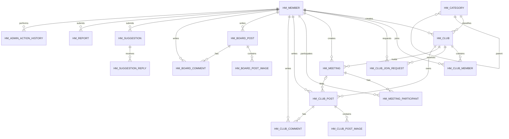

# HobbyMate ERD

## 참고

- `HM_REPORT.TARGET_ID`와 `HM_ADMIN_ACTION_HISTORY.TARGET_ID`는 다형 대상이므로 물리 FK가 없다.
- `HM_CLUB_POST.MEETING_ID`는 만남 모집글·후기글에서만 사용하며 자유글에서는 NULL이다.
- 모임 내부 게시판과 만남 접근 권한은 `HM_CLUB_MEMBER` 기준으로 서비스 계층에서 검증한다.
